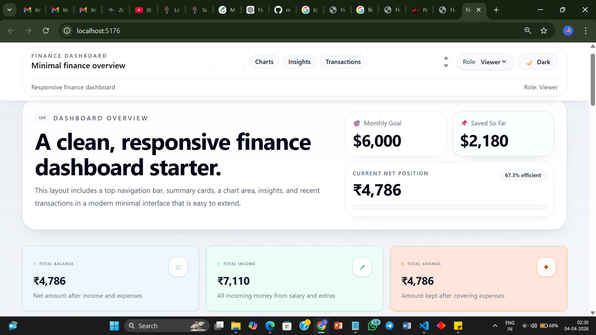

# Finance Dashboard UI

A responsive finance dashboard built with React.js and JavaScript for internship submission. The project presents a clean overview of financial data through summary cards, charts, transaction management, role-based UI, and theme support.

## Project Description

Finance Dashboard UI is a single-page dashboard application designed to help users track balances, income, expenses, transaction history, and insights in a visually organized way. The interface is built to be practical, readable, and easy to extend.

## Features Implemented

- Dashboard overview with summary cards
- Time-based visualization using a balance trend chart
- Categorical visualization using a spending breakdown chart
- Transaction list with desktop and mobile-friendly layouts
- Search, filter, sort, and grouping controls
- Role-based UI for `Viewer` and `Admin`
- Insights section with data-driven cards
- Responsive design for different screen sizes
- Dark mode support
- Export functionality for CSV and JSON files

## Dashboard Overview

The dashboard starts with a summary area that highlights the most important values at a glance:

- Total Balance
- Total Income
- Total Savings

These cards provide a quick financial snapshot before the user explores charts and transactions.

## Time-Based Visualization

The balance trend chart shows how the balance changes over time. It helps identify upward or downward movement across the selected transaction history and makes trends easier to understand.

## Categorical Visualization

The spending breakdown chart groups expenses by category using a donut chart and a matching legend. This makes it easier to compare where money is being spent.

## Transaction List

The transaction table displays all entries in a structured format with:

- Date
- Amount
- Category
- Type
- Description
- Actions for admin users

The list also supports responsive card-style rendering on smaller screens.

## Search / Filter / Sort

Users can refine the transaction list using multiple controls:

- Search by category or description
- Filter by income or expense
- Sort by date or amount
- Group transactions by category, month, or type
- Filter by category and date range

## Role-Based UI for Viewer and Admin

The dashboard supports two interface roles:

- `Viewer`: can explore and analyze the data
- `Admin`: can add, edit, and delete transactions

This role simulation helps demonstrate conditional UI rendering and permission-based interactions.

## Insights Section

The Insights section highlights important patterns and signals from the data. It is designed to surface useful observations such as top expense categories, monthly spending, and income patterns.

## Responsive Design

The layout is built to work across desktop, tablet, and mobile screens. Key sections reflow naturally, and the transaction list adapts to smaller devices for better readability.

## Dark Mode

Dark mode is supported throughout the dashboard. Theme state is stored in the app context and persisted in local storage so the selected theme remains available after refresh.

## Export Functionality

Export is implemented for the transaction list with:

- CSV export
- JSON export

This allows users to download filtered transaction data for external use.

## Tech Stack

- React.js
- JavaScript (ES modules)
- Vite
- Tailwind CSS
- Recharts

## Folder Structure

```text
src/
├── components/
│   ├── dashboard/
│   │   ├── BalanceTrendChart.jsx
│   │   ├── ExpenseBreakdownChart.jsx
│   │   ├── InsightCard.jsx
│   │   ├── SectionCard.jsx
│   │   ├── SummaryCard.jsx
│   │   ├── TransactionFormModal.jsx
│   │   └── TransactionsTable.jsx
│   └── layout/
│       ├── AppLayout.jsx
│       ├── Header.jsx
│       └── Sidebar.jsx
├── context/
│   └── DashboardContext.jsx
├── data/
│   ├── dashboardData.js
│   └── transactionsData.js
├── pages/
│   └── DashboardPage.jsx
├── utils/
│   └── transactionUtils.js
├── App.jsx
├── main.jsx
└── index.css
```

## How to Run the Project Locally

### Prerequisites

- Node.js installed on your machine
- npm available in your terminal

### Steps

1. Install dependencies:

```bash
npm install
```

2. Start the development server:

```bash
npm run dev
```

3. Open the local URL shown in the terminal, usually:

```text
http://localhost:5173
```

### Optional Production Preview

```bash
npm run build
npm run preview
```

## Screenshot Placeholders

You can add screenshots below before submission:

- Dashboard overview screenshot
- Charts and insights screenshot
- Transactions table screenshot
- Dark mode screenshot

Example:

```md


```

## State Management Approach

The project uses React Context to manage dashboard-wide state such as:

- Transactions
- Role selection
- Theme mode
- Search and filter options
- Sort settings
- Grouping and date range filters
- Modal state

This keeps shared dashboard behavior in one place and reduces prop drilling.

## Theme / UI Design Approach

The UI is built around a clean dashboard shell with soft surfaces, rounded cards, and clear hierarchy. The design approach emphasizes readability and balance:

- Neutral base layout with polished surfaces
- Soft pastel accents for summary and insight cards in light mode
- Strong dark-mode contrast for accessibility
- Consistent spacing and card structure
- Subtle motion and hover states for a modern feel

## Assumptions Made

- The project is intended as a frontend dashboard demo rather than a backend-connected financial system.
- Transaction data is mock data and can later be replaced with API-driven data.
- Role-based UI is simulated in the frontend for demonstration purposes.
- Export functionality is client-side and downloads filtered table data from the browser.

## Future Improvements

- Connect the dashboard to a real backend or database
- Add authentication and real permissions
- Include more chart types for deeper analysis
- Add monthly/yearly comparison views
- Improve accessibility testing and keyboard navigation coverage
- Add unit and integration tests for critical dashboard logic

## Conclusion

Finance Dashboard UI demonstrates a practical and visually organized React dashboard with data exploration, role-based interactions, theming, responsive layouts, and export support. It is suitable for internship review because it shows component-based development, shared state handling, and thoughtful UI design in a complete working project.
